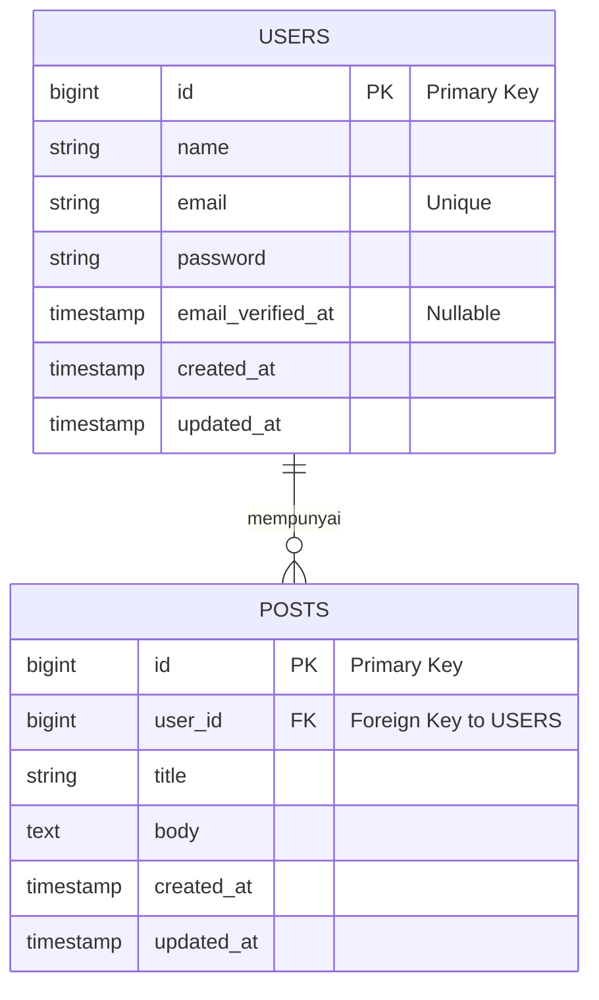

# Fullstack Blog App (Laravel & Next.js)

Project ini adalah implementasi sistem Blog sederhana (Post Management) dengan fitur Authentication, dibangun menggunakan **Laravel** sebagai backend API dan **Next.js (App Router)** sebagai frontend.

Project ini dibuat untuk memenuhi Technical Test PT Garuda Cyber Indonesia.

## Fitur Utama
- **Authentication**: Sign Up, Sign In, Sign Out (Token-based menggunakan Laravel Sanctum).
- **Post Management (CRUD)**:
  - Menampilkan semua post dengan pagination server-side.
  - Melihat detail post.
  - Membuat post baru.
  - Edit & Hapus post (dengan validasi hanya pemilik post yang dapat melakukan aksi ini).
- **UI/UX**: Menggunakan DaisyUI & Tailwind CSS. Dilengkapi dengan Skeleton loading, serta penanganan *empty state*.

---

## Tech Stack
- **Backend**: Laravel 11, MySQL / PostgreSQL, Laravel Sanctum
- **Frontend**: Next.js 15 (App Router), Tailwind CSS, DaisyUI

---

## Struktur Direktori

Project ini dibungkus dalam satu *repository* tunggal dengan pemisahan folder yang jelas antara Backend dan Frontend:

```text
simple-project-test/
├── laravel/                  # Backend REST API (Laravel 11)
│   ├── app/
│   │   ├── Http/Controllers/ # Logic API (AuthController, PostController)
│   │   └── Models/           # Model Database (User, Post)
│   ├── database/
│   │   └── migrations/       # Skema Database
│   └── routes/
│       └── api.php           # Definisi Endpoint API
│
└── nextjs/                   # Frontend App (Next.js 15 App Router)
    ├── app/                  # Rute Halaman (Pages & Layout)
    │   ├── login/
    │   ├── register/
    │   └── posts/            # Antarmuka CRUD untuk Posts
    ├── components/           # Reusable UI Components (cth: Navbar)
    └── lib/                  # Konfigurasi & State Management
        ├── api.js            # Setup koneksi Fetch API ke Laravel
        └── AuthContext.js    # Global State untuk Autentikasi User
```

---

## Struktur Database (ERD)

Berikut adalah struktur tabel utama yang digunakan dalam aplikasi ini:



### 1. Tabel `users`
Menyimpan data otentikasi dan profil pengguna.

| Kolom | Tipe Data | Keterangan |
| :--- | :--- | :--- |
| `id` | bigint (Unsigned) | Primary Key, Auto Increment |
| `name` | varchar(255) | Nama lengkap pengguna |
| `email` | varchar(255) | Email pengguna (Unique) |
| `email_verified_at` | timestamp | Waktu verifikasi email (Nullable) |
| `password` | varchar(255) | Password yang sudah di-hash (Bcrypt) |
| `remember_token`| varchar(100) | Token untuk fitur remember me (Nullable) |
| `created_at` | timestamp | Waktu akun dibuat |
| `updated_at` | timestamp | Waktu akun terakhir diupdate |

### 2. Tabel `posts`
Menyimpan data artikel atau post yang dibuat oleh pengguna.

| Kolom | Tipe Data | Keterangan |
| :--- | :--- | :--- |
| `id` | bigint (Unsigned) | Primary Key, Auto Increment |
| `user_id` | bigint (Unsigned) | Foreign Key merujuk ke `users(id)` dengan relasi `Cascade on Delete` |
| `title` | varchar(255) | Judul post |
| `body` | text | Isi / konten post |
| `created_at` | timestamp | Waktu post dibuat |
| `updated_at` | timestamp | Waktu post terakhir diupdate |

> *Catatan: Selain dua tabel domain utama di atas, aplikasi ini juga menggunakan tabel bawaan dari ekosistem Laravel seperti `personal_access_tokens` (untuk manajemen token autentikasi Sanctum), `migrations` (untuk tracking riwayat skema database), `password_reset_tokens`, dan `sessions`.*

## Cara Instalasi & Menjalankan Project

### 1. Setup Backend (Laravel)

1. Buka terminal dan masuk ke folder laravel:
   ```bash
   cd laravel
   ```
2. Salin file `.env.example` menjadi `.env`:
   ```bash
   cp .env.example .env
   ```
3. Buka file `.env` dan atur konfigurasi database:
   ```env
   DB_CONNECTION=mysql
   DB_HOST=128.0.0.1
   DB_PORT=3306
   DB_DATABASE=
   DB_USERNAME=root
   DB_PASSWORD=
   ```
4. Instal dependensi PHP:
   ```bash
   composer install
   ```
5. Generate application key:
   ```bash
   php artisan key:generate
   ```
6. Jalankan migrasi database:
   ```bash
   php artisan migrate
   ```
7. Jalankan server lokal backend:
   ```bash
   php artisan serve
   ```
   *(Backend akan berjalan di http://localhost:8000)*

---

### 2. Setup Frontend (Next.js)

1. Buka terminal baru dan masuk ke folder nextjs:
   ```bash
   cd nextjs
   ```
2. Instal dependensi Javascript:
   ```bash
   npm install
   ```
3. Pastikan URL API backend pada `lib/api.js` sudah sesuai menunjuk ke `http://localhost:8000/api`.
4. Jalankan server lokal frontend:
   ```bash
   npm run dev
   ```
   *(Frontend akan berjalan di http://localhost:3000)*

---

## Catatan Keputusan Teknis

1. **Pemisahan Backend dan Frontend**
   Backend (Laravel) dibuat khusus untuk menyediakan API saja, sedangkan urusan tampilan sepenuhnya dipegang oleh Frontend (Next.js). Cara ini mempermudah saya jika ke depannya ada perubahan di salah satu sisi tanpa mengganggu sisi lainnya.

2. **State Management Login**
   Untuk menyimpan data user yang sedang login, saya menggunakan `React Context` (`AuthContext.js`). Jadi saya tidak perlu repot mengirim data user satu-satu ke setiap komponen. Token login disimpan di `localStorage` agar user tidak perlu login ulang setiap kali halaman di-*refresh*.

3. **Proteksi Halaman (Next.js)**
   Halaman daftar post hanya bisa diakses kalau user sudah login. Jika belum, saya membuat logika sederhana untuk otomatis mengembalikan (*redirect*) user ke halaman `/login`. ini merupakan implementasi dari middleware laravel sanctum.

4. **Keamanan Tambahan (Laravel)**
   Selain menyembunyikan tombol Edit dan Delete di tampilan web jika post bukan milik user tersebut, saya juga menguncinya di sisi API. Jika ada yang iseng memaksa menghapus post orang lain langsung tembak ke API, Laravel akan menolak dan mengembalikan error `403 Forbidden`.

5. **Pagination di Sisi Server**
   Sesuai permintaan tes, pagination dilakukan langsung oleh database Laravel (`paginate(10)`). Jadi Next.js hanya meminta data per halaman (`?page=x`) agar website tetap ringan.

6. **Penggunaan UI**
   Untuk mempercepat pembuatan antarmuka tanpa menulis custom CSS dari nol, saya menggunakan desain standar dari DaisyUI dan Tailwind CSS yang sudah cukup rapi.


## notes 

Terdapat seeder yang dapat membuat akun otomatis dan post, ini saya buat untuk memeriksa fitur pagination, hak akses edit dan hapus berjalan lancar dan sesuai permintaan.
